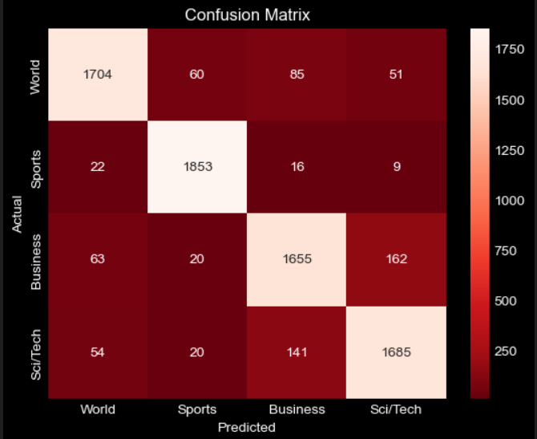
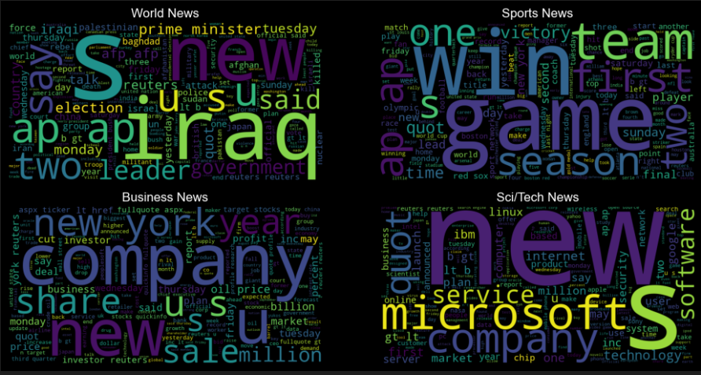

# ​ AG's News Topic Classification

A machine learning project that classifies news articles into one of four categories using **TF-IDF vectorization** and **Logistic Regression**.

---

## ​ Overview
This project uses the **AG's News Topic Classification** dataset to build a multi-class text classification model.  
We preprocess the data (cleaning, tokenization, stopword removal, lemmatization), extract features using **TF-IDF**, train a Logistic Regression model, and evaluate performance using **Accuracy** and a **Confusion Matrix**.

---

## ​ About the Dataset
**Source:**  
[AG News Classification Dataset on Kaggle](https://www.kaggle.com/datasets/amananandrai/ag-news-classification-dataset)

**Origin:**  
AG is a collection of over 1 million news articles gathered from 2000+ sources by *ComeToMyHead*, an academic news search engine active since July 2004.

**Construction:**  
From this corpus, four largest categories were selected to create a benchmark dataset:
- **Training set:** 120,000 samples (30,000 per class)  
- **Test set:** 7,600 samples (1,900 per class)

The dataset includes:
- `train.csv` and `test.csv` — Each with class index (1–4), title, and description

---

## ​​ Installation
```bash
git clone https://github.com/yourusername/ag-news-classification.git
cd ag-news-classification
```

## Usage
Open the notebook:
```
jupyter notebook "News Category.ipynb"
```

## Results
Model: Logistic Regression
Vectorizer: TF-IDF (max_features=5000)
Accuracy: 90.75% 

#  Confusion Matrix:

# Word Clouds:



---

## 📜 License
This project is licensed under the MIT License.
